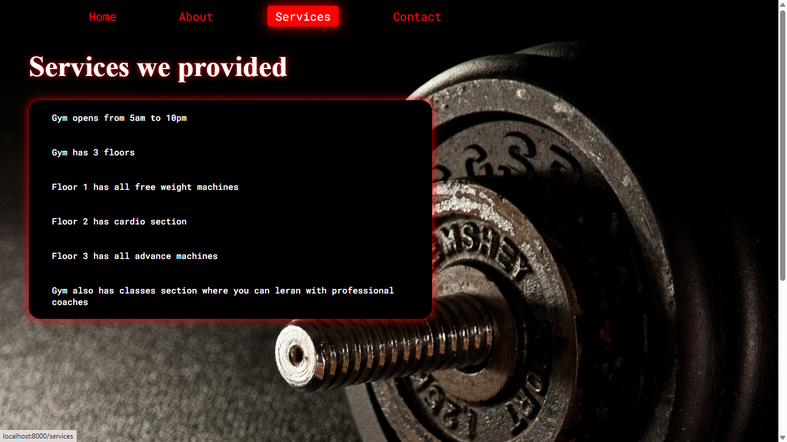
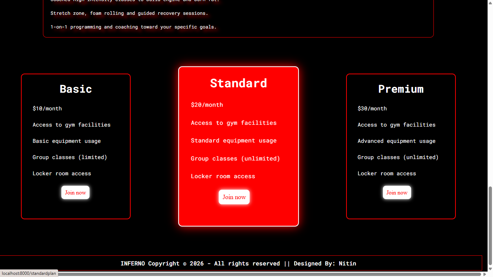
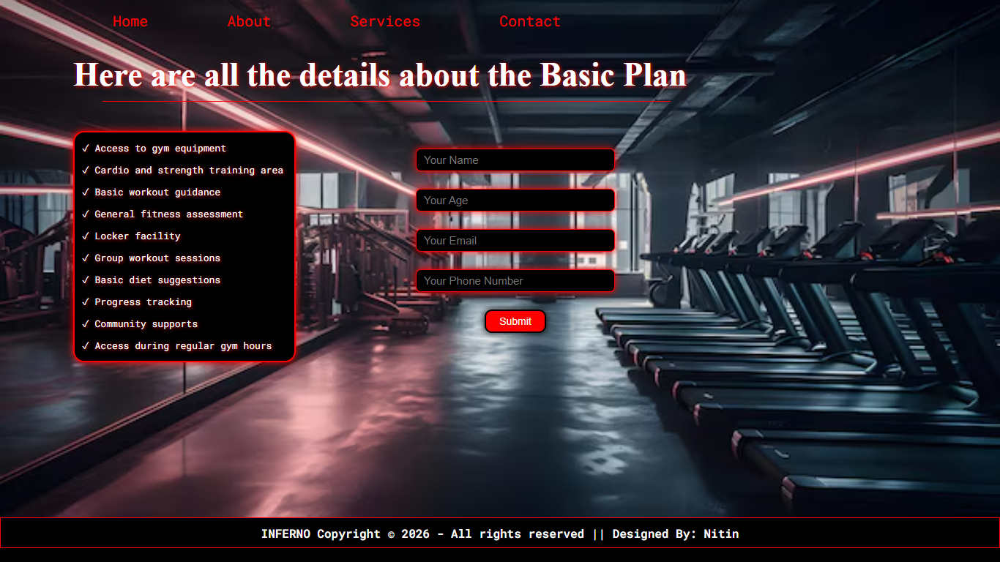
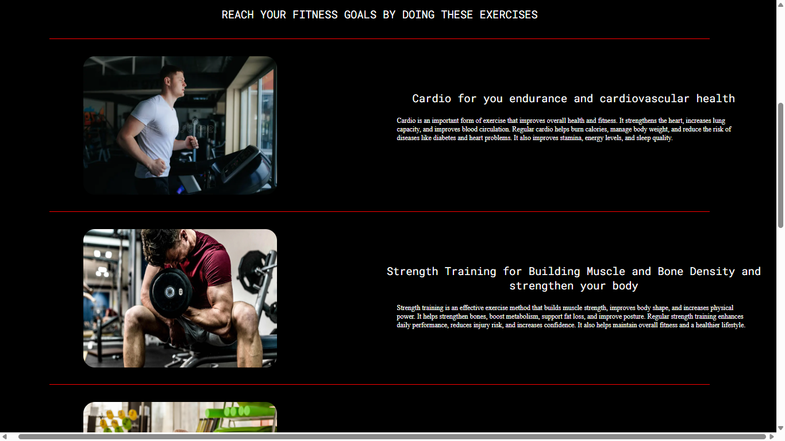

# Gym Website

A full-stack gym website built with Node.js, Express, Pug, MongoDB and JavaScript.

## Screenshots

### Home Page

### About Page

### Services Page

### Contact Page

### Plans

### Plan Information

### Exercises

# Gym Website

A fully responsive full-stack gym website built using Node.js, Express.js, MongoDB, Pug, CSS and JavaScript.

## 🔗 Live Demo

👉 https://gym-website-b7ph.onrender.com/

## Features

- Responsive Design
- Membership Plans
- Contact Form
- MongoDB Integration
- Smooth Animations
- Clean UI